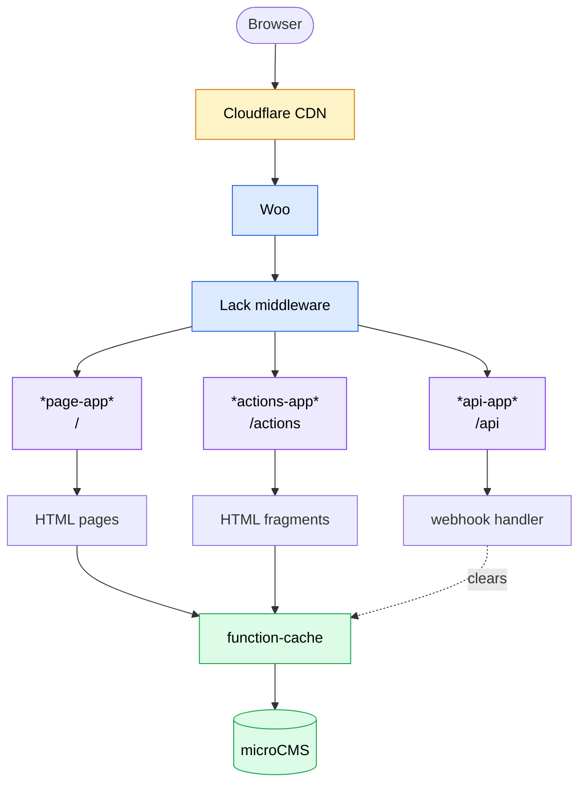

# website

My personal website — [skyizwhite.dev](https://skyizwhite.dev)

A server-rendered site built in **Common Lisp**, sourcing content from a headless CMS and serving HTML with Next.js-style caching semantics behind a CDN.

## Tech Stack

| Layer | Choice |
| --- | --- |
| Language | Common Lisp (SBCL) |
| Dependency manager | [qlot](https://github.com/fukamachi/qlot) |
| Web stack | [Clack](https://github.com/fukamachi/clack) / [Lack](https://github.com/fukamachi/lack) |
| HTTP server | [Woo](https://github.com/fukamachi/woo) (production), Hunchentoot (development) |
| Routing framework | [jingle](https://github.com/dnaeon/cl-jingle) + [ningle-fbr](https://github.com/skyizwhite/ningle-fbr) (file-based routing) |
| Server actions | [ningle-actions](https://github.com/skyizwhite/ningle-actions) — partial-update endpoints in an isolated `/actions` namespace |
| View / templating | [hsx](https://github.com/skyizwhite/hsx) — JSX-like HTML as Lisp s-expressions |
| Content | [microCMS](https://microcms.io/) via [microcms-lisp-sdk](https://github.com/skyizwhite/microcms-lisp-sdk) |
| Caching | [function-cache](https://github.com/AccelerationNet/function-cache) (in-memory) + HTTP `Cache-Control` |
| Styling | [Tailwind CSS](https://tailwindcss.com/) v4 (standalone binary) |
| Interactivity | [nomini](https://nomini.js.org/) (reactivity + fragment fetch/swap, self-hosted) |
| CDN | Cloudflare |
| Task runner | [just](https://github.com/casey/just) |
| Deployment | [Coolify](https://coolify.io/) (Docker) |

## Architecture



- **Package-inferred system.** Each file is its own package (`:class :package-inferred-system`); dependencies are resolved from `import-from` clauses.
- **File-based routing.** `ningle-fbr` maps files under `src/pages/` to HTML routes and `src/api/` to JSON routes. A file exporting `@get` / `@head` / `@post` becomes a handler; `<blog-id>.lisp` is a dynamic segment.
- **Three sub-apps.** `*page-app*` wraps every result in `~document` and renders it to an HTML string; `*actions-app*` (from `ningle-actions`, plugged into the `*page-app*` middleware chain by `*actions-middleware*` and mounted under `/actions`) renders results as bare HTML fragments for nomini swaps; `*api-app*` serializes results to JSON and is mounted under `/api`.
- **nomini server actions.** `ningle-actions` keeps fragment-update endpoints out of the meaningful page URL space by giving them their own isolated `/actions` namespace. `defaction` does two things at once: it registers an HTTP handler under an opaque, auto-generated `/actions/<id>` URL, and it defines a function of the same name that returns that URL (keyword arguments become URL-encoded query-string params, e.g. `(get-likes :blog-id blog-id)`). A page embeds that function's **return value** in a nomini `nm-bind` fetch call (`$get` / `$fetch`) instead of a URL literal, so the action URL never appears as a string anywhere and the handler and its view can't drift out of sync. Fragment responses carry an `id` (and optional `nm-swap` strategy) that nomini matches against the live DOM to swap in place; the guard macro `with-nm-request` (in `src/helper.lisp`) rejects requests lacking the `nm-request` header. The blog **like button** (`src/components/like-button.lisp`, wired up in `src/pages/blog/<blog-id>.lisp`) uses this: the pill is lazily loaded via an `IntersectionObserver`, a `PATCH` records the like to the microCMS `likes` field, and the response swaps in the liked state with a "Thank you!" toast (CSS transitions driven by a nomini `nm-data` flag).
- **One like per visitor.** Liked post ids are stored in a `liked_blogs` cookie (`src/lib/liked-posts.lisp` over the generic `src/lib/cookie.lisp`). When lazily loaded the button is rendered in its disabled "already liked" state for returning visitors; the `PATCH` only increments for a first-time like (and returns `409` otherwise), then records the id in the cookie. These per-visitor fragments are served `Cache-Control: private, no-store` so the CDN never shares them.
- **CMS-backed content.** `src/lib/cms.lisp` fetches `about`, `works`, and `blog` content from microCMS. Calls are memoized with `function-cache`.
- **Next.js-style cache control.** `set-cache` (in `src/helper.lisp`) sets `Cache-Control` per page using one of three strategies:
  - `:ssr` — always revalidate (`max-age=0, must-revalidate`)
  - `:isr` — incremental static regeneration (`s-maxage=60, stale-while-revalidate`)
  - `:sg`  — static generation (`s-maxage=1yr`)
  - In dev mode all responses are `no-store`.
- **On-demand revalidation.** A microCMS webhook hits `POST /api/revalidate` (auth via `X-MICROCMS-WEBHOOK-KEY`), which clears the relevant function-cache entries. On container start, `entrypoint.sh` purges the Cloudflare cache once the server is ready.

## Project Layout

```
src/
├── main.lisp          # start / stop / reload (REPL entry points)
├── app.lisp           # app composition, middleware, sub-app mounting
├── document.lisp      # top-level HTML shell
├── helper.lisp        # shared request/response helpers
├── components/        # reusable hsx components
├── lib/               # shared utility modules
├── pages/             # file-based HTML routes (+ defaction handlers, e.g. blog likes)
└── api/               # file-based JSON routes
assets/                # styles, images, static files
```

## Development

```sh
just install     # download the Tailwind binary + install qlot dependencies
just watch       # rebuild CSS on change
just build       # build the production CSS bundle
just lem         # open the Lem editor with the CSS watcher running
```

Start the server from a Lisp REPL:

```lisp
(ql:quickload :website)
(website:start)   ; serves on http://localhost:3000
(website:reload)  ; reload code and restart
(website:stop)
```

Configure via `.env` (see `.env.example`):

```
WEBSITE_ENV               # "dev" enables dev-mode caching/error pages
WEBSITE_URL               # canonical base URL
MICROCMS_SERVICE_DOMAIN
MICROCMS_API_KEY
MICROCMS_WEBHOOK_KEY      # validates the revalidate webhook
CLOUDFLARE_ZONE_ID        # optional, for cache purge on deploy
CLOUDFLARE_API_KEY
```

## Deployment

Deployed on [Coolify](https://coolify.io/), which builds the `Dockerfile` and runs the container. The `Dockerfile` builds the system with qlot, minifies the Tailwind CSS, and runs `entrypoint.sh`, which serves the app with Woo on port `3000` and purges the Cloudflare cache after the rolling update completes.
